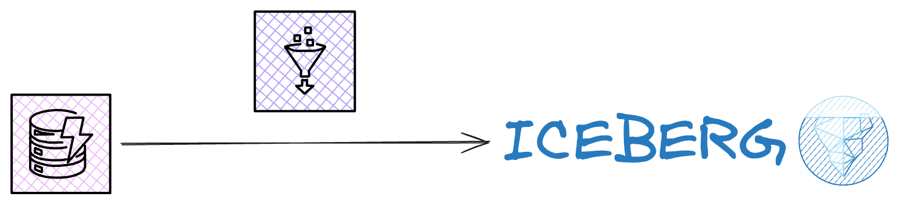
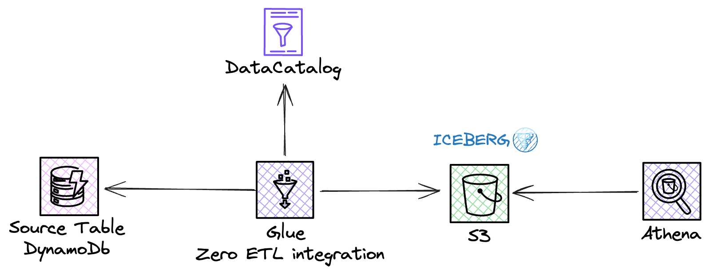

 

 
<strong>Glue Zero-ETL integrations</strong> 

Using Glue Zero-ETL integrations to replicate data from DynamoDB tables to Apache Iceberg tables

Complete code for this Blog post: https://zied-ben-tahar.medium.com/9397523bfea2

